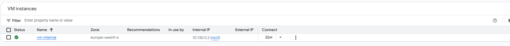
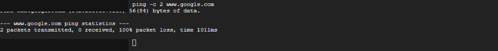
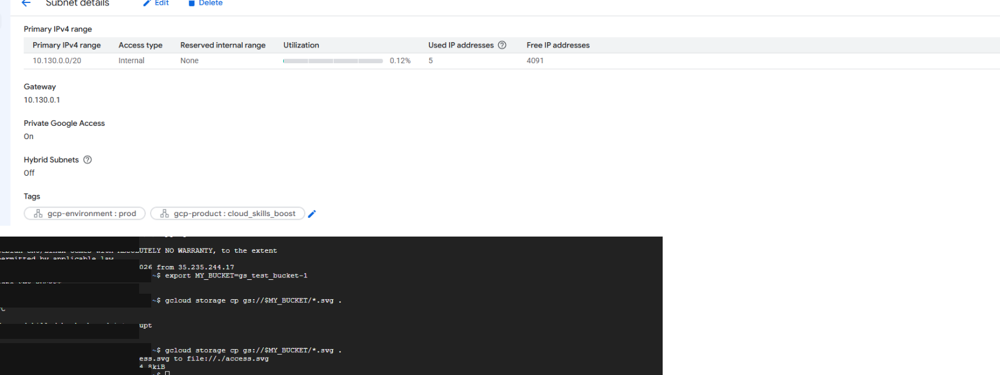
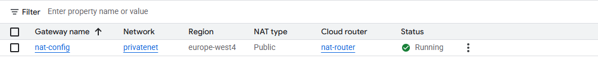
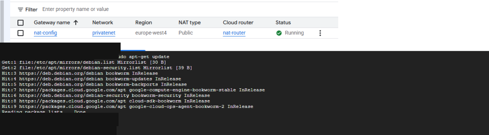
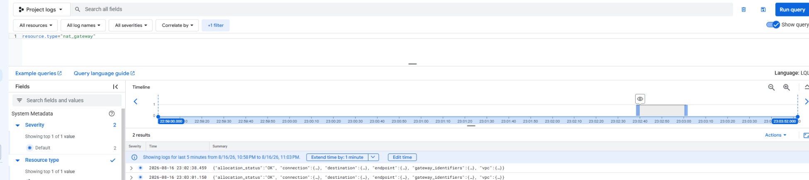
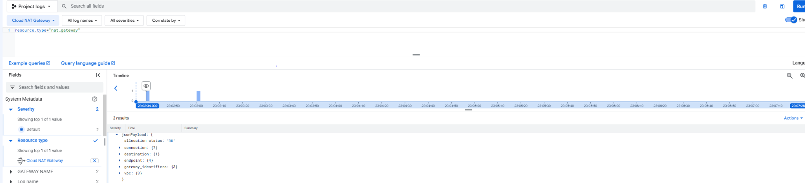

# Google Cloud Private Access and Cloud NAT Lab

This repository documents a Google Cloud Skills Boost lab where I built a VM without an external IP address and then tested different ways to give it controlled outbound access.

The main goal was to keep the VM private while still allowing secure administration, access to supported Google services, outbound internet access, and logging of NAT connections.

> **Training note:** This was completed in a temporary Google Cloud Skills Boost environment. It was hands-on training, not a production deployment.

## What I Built

The lab environment included:

- A custom VPC named `privatenet`
- A subnet named `privatenet-us`
- An SSH firewall rule limited to Google IAP
- A VM named `vm-internal` with no external IP address
- Private Google Access enabled on the subnet
- A Cloud NAT gateway named `nat-config`
- A Cloud Router named `nat-router`
- Cloud NAT logging viewed in Logs Explorer

The access path looked like this:

```text
Admin access:
Cloud Shell ---> IAP tunnel ---> vm-internal

Google services:
vm-internal ---> Private Google Access ---> supported Google APIs/services

General outbound internet:
vm-internal ---> Cloud NAT ---> internet
```

## What I Practiced

- Creating a custom VPC and subnet
- Restricting SSH access to the IAP address range
- Deploying a VM without an external IP address
- Connecting to a private VM through an IAP tunnel
- Testing connectivity before outbound access was configured
- Enabling Private Google Access at the subnet level
- Accessing Cloud Storage from a private-only VM
- Creating a Cloud NAT gateway and Cloud Router
- Verifying outbound package access through Cloud NAT
- Enabling and reviewing Cloud NAT flow logs

## Lab Walkthrough

### 1 — Created a Private VM

I created `vm-internal` in the custom `privatenet` VPC and configured the network interface with no external IPv4 address.

That gave the VM an internal address only.



### 2 — Connected Through IAP and Tested Connectivity

I connected to `vm-internal` through an Identity-Aware Proxy tunnel instead of exposing SSH directly to the internet.

Before Private Google Access or Cloud NAT was configured, I tested external connectivity from the VM. The request failed with 100% packet loss.



### 3 — Enabled Private Google Access

I used a Cloud Storage bucket to test access to a Google API from the private VM.

Before Private Google Access was enabled, the copy request from `vm-internal` did not complete. I then enabled Private Google Access on `privatenet-us` and repeated the same Cloud Storage copy.

The second attempt completed successfully while the VM still had no external IP address.



### 4 — Configured Cloud NAT

I created the `nat-config` Cloud NAT gateway on `privatenet` using the `nat-router` Cloud Router.

The gateway reached a `Running` state.



### 5 — Verified Outbound Internet Access

After Cloud NAT was available, I ran `sudo apt-get update` from `vm-internal`.

The VM was able to reach Debian and Google package repositories and the update completed with:

```text
Reading package lists... Done
```

The VM still did not have its own external IP address.



### 6 — Enabled and Reviewed Cloud NAT Logging

I enabled Cloud NAT logging for translations and errors, generated outbound traffic from the private VM, and filtered Logs Explorer for the `nat_gateway` resource type.

The NAT flow results showed successful allocations and connection-related fields.



I then expanded one NAT flow entry to review additional details such as the connection, destination, endpoint, gateway identifiers, and VPC fields.



## What I Learned

The biggest thing I took away from this lab is that a VM does not need its own public IP address to be useful.

IAP gave me a way to administer the VM without opening SSH to the public internet. Private Google Access let the VM reach supported Google services, and Cloud NAT handled broader outbound internet access without making the VM directly reachable from outside the VPC.

The NAT logging portion also helped connect the network configuration to visibility. I could see that the outbound connections were actually passing through the NAT gateway instead of just assuming the configuration worked.

## Why It Mattered

This lab helped me separate three different networking needs that can look similar at first:

- **Administration** through IAP
- **Private access to Google services** through Private Google Access
- **General outbound internet access** through Cloud NAT

Keeping those functions separate makes it easier to understand how a private workload can stay isolated from unsolicited inbound internet traffic while still getting the outbound connectivity it needs.

## Evidence Notes

The screenshots in this repository were captured from the temporary Skills Boost environment. Temporary student identifiers, project identifiers, and unnecessary lab-specific values were removed from the portfolio copies.

## Status

✅ Completed
